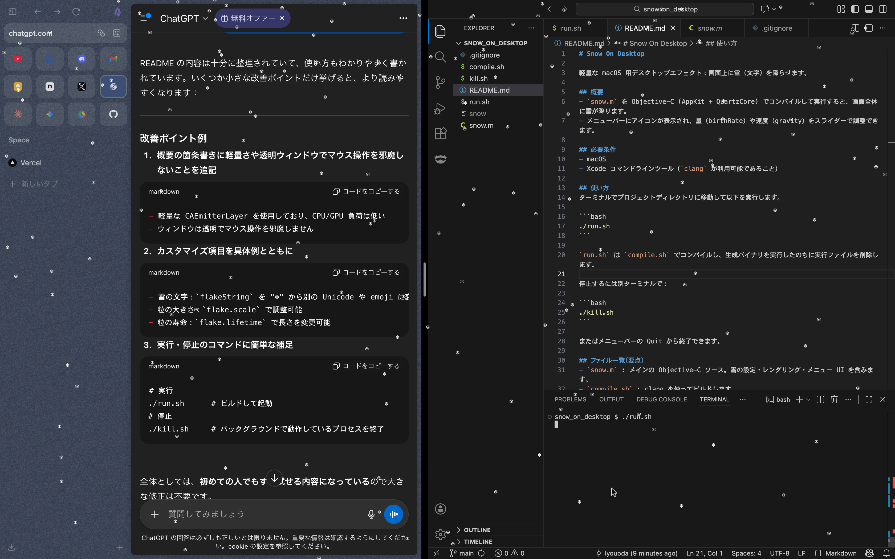

# Snow On Desktop

軽量な macOS 用デスクトップエフェクト：画面上に雪（文字）を降らせます。



## 概要
- `snow.m` を Objective-C (AppKit + QuartzCore) でコンパイルして実行すると、画面全体に雪が降ります。
- メニューバーにアイコンが表示され、量（birthRate）や速度（gravity）をスライダーで調整できます。

## 必要条件
- macOS
- Xcode コマンドラインツール（`clang` が利用可能であること）

## 使い方
ターミナルでプロジェクトディレクトリに移動して以下を実行します。

```bash
./run.sh
```

`run.sh` は `compile.sh` でコンパイルし、生成バイナリを実行したのちに実行ファイルを削除します。

停止するには別ターミナルで：

```bash
./kill.sh
```

またはメニューバーの Quit から終了できます。

## ファイル一覧（要点）
- `snow.m` : メインの Objective-C ソース。雪の設定・レンダリング・メニュー UI を含みます。
- `compile.sh` : clang を使ってビルドします。
- `run.sh` : ビルドして実行します。
- `kill.sh` : 実行中の `snow` プロセスを終了します。

## カスタマイズ
- 雪に使う文字は `snow.m` 内の `SnowSettings` の `flakeString`で変更できます。
- 雪の量（`birthRate`）や落下の加速度（`gravity`）はメニューのスライダー、もしくは `snow.m` 内の初期値を編集して変更できます。

## 注意点
- 実行時にアクセシビリティ権限や「すべてのアプリケーションを制御」等は不要ですが、環境によっては画面やウィンドウの動作に制限がかかる場合があります。
- バイナリはローカルで生成されます（`run.sh` は実行後に `snow` を削除します）。
